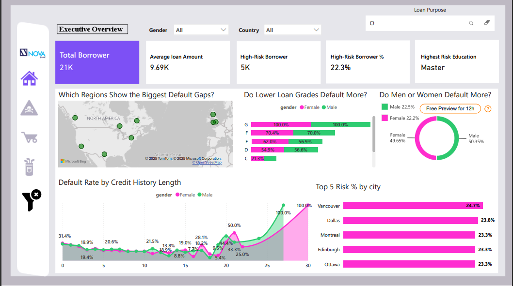
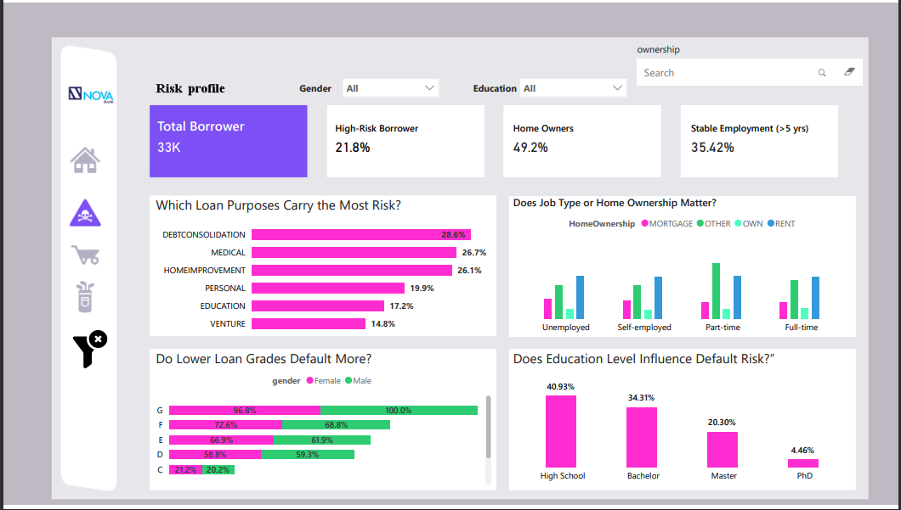
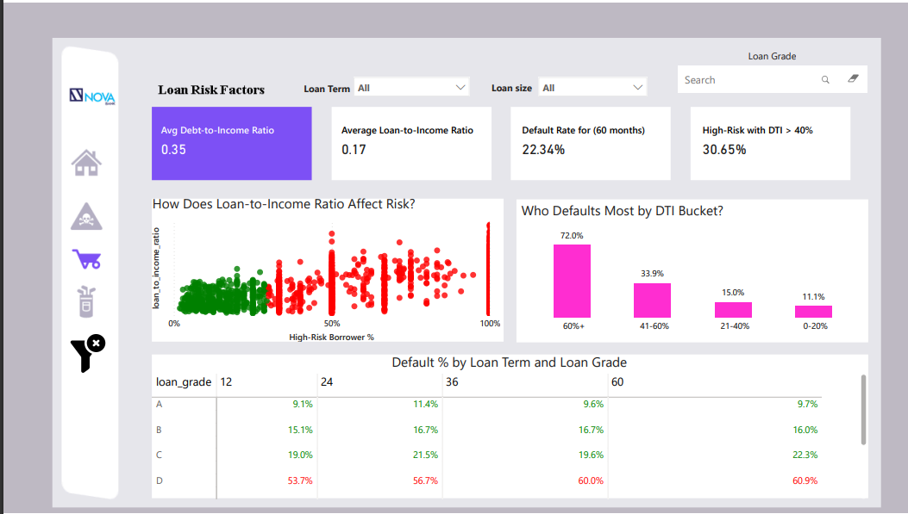
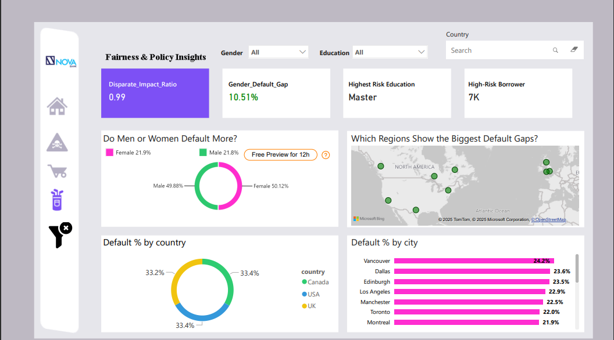

# Nova Bank Credit Risk Analytics Dashboard

## 📌 Project Overview
This project was created as part of the **Onyx Data x ZoomCharts DataDNA Challenge**.  
As a Credit Risk Analyst at **Nova Bank**, the goal was to identify lending risks, predict defaults, and ensure fairness across loan decisions.

The dashboard helps the bank answer:
- **Who defaults more?**
- **Which loan sizes and income groups are riskier?**
- **How do interest rates and repayment terms affect defaults?**
- **Are lending policies fair across regions and demographics?**

---

## ⚡ Features
- **5-page Power BI dashboard** 
- **KPIs**: Total Borrowers, Default %, Average Loan, Average Interest Rate
- **Visuals**: Risk by loan size, income, geography, repayment terms
- **Fairness Analysis**: Defaults by state, country, city
- **Custom DAX Measures** for loan size buckets and risk ratios

---

## 🛠️ Tools Used
- **Power BI** for dashboarding
- **DAX** for calculated measures
- **Power Query** for data preprocessing

---

## 📊 Dashboard Preview
| Executive Overview | Borrower Profile |
|--------------------|------------------|
|  |  |

| Risk Factors | Fairness Policies |
|--------------|------------------|
|  |  |

Dashboard link: https://app.powerbi.com/view?r=eyJrIjoiNGNlNzBmY2YtOGI0OS00N2M0LTg0ZjItNTU3NjBiZDgxZDJkIiwidCI6IjdhNmRlNDA0LWI0YzEtNGU0OC1iNGQ3LWQzYTk3M2ZjOWQ4ZiIsImMiOjEwfQ%3D%3D
